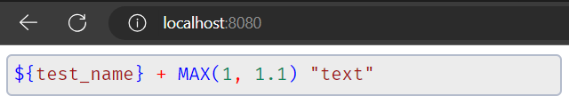

<h1 align="center">code_input</h1>

<p align="center">
本项目是一个适用于 <code>vue2</code> 和 <code>vue3</code> 的代码高亮输入框组件，轻量高速且只支持高亮及编辑功能，不支持代码检查等其他功能。
</p>

<center>
  
</center>

## 🍔使用

### 🫖下载包

`npm` 方式：

```bash
npm install @mochenya/code_input -D
```

`yarn` 方式：

```bash
yarn add @mochenya/code_input
```

### 🍳配置

#### 🥯vue2 配置

在 `vue2` 项目的 `main.ts` 添加以下内容：

```js
// 引入 code_input
import CodeInput from "@mochenya/code_input";
// 引入样式表
import "@mochenya/code_input/dist/code-input.css";
// 使用 code_input
Vue.use(CodeInput);
```

在需要使用 `code_input` 的组件中使用以下代码：

```html
<template>
  <div>
    <code-input v-model="codeData"/>
  </div>
</template>
```

#### 🧀vue3 配置

在 `vue3` 项目的 `main.ts` 添加以下内容：

```js
// TODO 待完成
```

## 🍜License

[MIT](./LICENSE)
